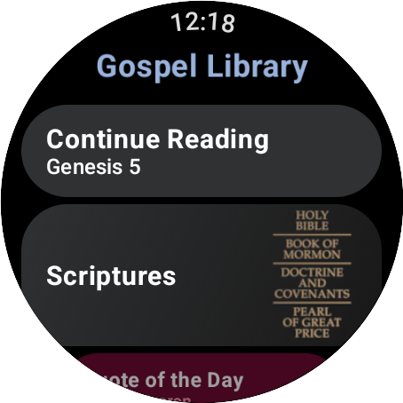
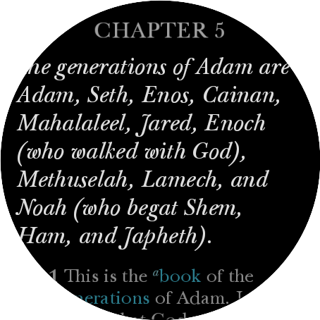

# Gospel Library For WatchOS

This is a WatchOS app that allows you to read the scriptures on your Android Wear device. It does not require an Android phone to work. It is a standalone app that can be installed directly on your watch.

## About

The scriptures are stored on the watch and can be read without an internet connection. The app is designed to be simple and easy to use. It includes the standard works of the Church of Jesus Christ of Latter-day Saints, including the Bible, Book of Mormon, Doctrine and Covenants, and Pearl of Great Price.

The scriptures are used from this repository: https://github.com/allancoding/scriptures

## Screenshots

## Installation

You need to build the APP in Android Studio and install it on your watch using android debugging tools.
Or you can download the APK from the releases page and install it on your watch using adb.